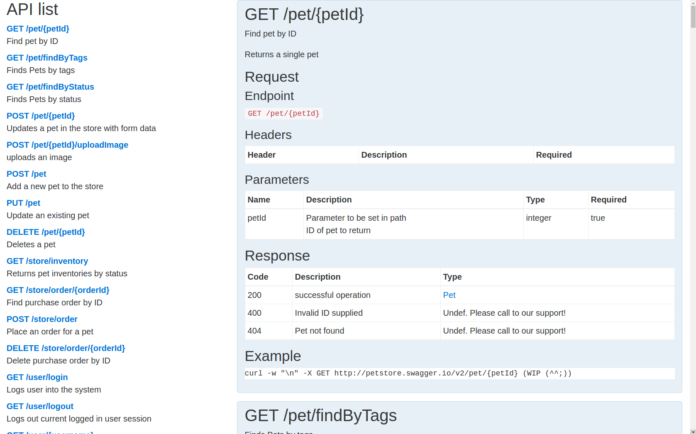

swagger-page
============

Rendering API document from swagger 2.0 JSON



Usage;
------

```
<script src="https://cdnjs.cloudflare.com/ajax/libs/underscore.js/1.8.3/underscore-min.js"></script>
<script src="https://cdnjs.cloudflare.com/ajax/libs/handlebars.js/4.0.5/handlebars.min.js"></script>
<script src="https://cdnjs.cloudflare.com/ajax/libs/marked/0.3.5/marked.min.js"></script>
<script src="swagger-page.js"></script>
<script>
  var swaggerPage = new SwaggerPage({json_text: Swagger2.0APIJSONtext});
  document.getElementById('target').innerHTML = swaggerPage.renderHTML('toc_apis');
</script>

<div id="target"></div>
```

renderHTML options are

* `toc_apis` : API index
* `toc_models` : Model index
* `spec_apis` : API spec
* `spec_models` : Model spec

Required libs are included,

* underscore.js 1.8.3 or higher
* handlebars.js 4.0.5 or higher
* marked.js 0.3.5 or higher

Recommend libs,

* Bootstrap 4 (for decoration. Sample using in sample.html)

### Advanced using; ###

w/ XMLHttpRequest(Ajax):

```
<script>
  window.onload = function () {
    var xhr = new XMLHttpRequest();
    xhr.open('GET', 'http://petstore.swagger.io/v2/swagger.json');
    xhr.onload= function(e) {
      if (this.status == 200) {
        var swaggerPage = new SwaggerPage({json_text: this.response});
        _.each(['toc_apis', 'toc_models', 'spec_apis', 'spec_models'], function(i) {
          document.getElementById(i).innerHTML = swaggerPage.renderHTML(i);
        });
      }
    };
    xhr.send();
  };
</script>
<div id="toc_apis"></div>
<div id="toc_models"></div>
<div id="spec_apis"></div>
<div id="spec_models"></div>
```

LICENSE
-------

MIT

EoT
